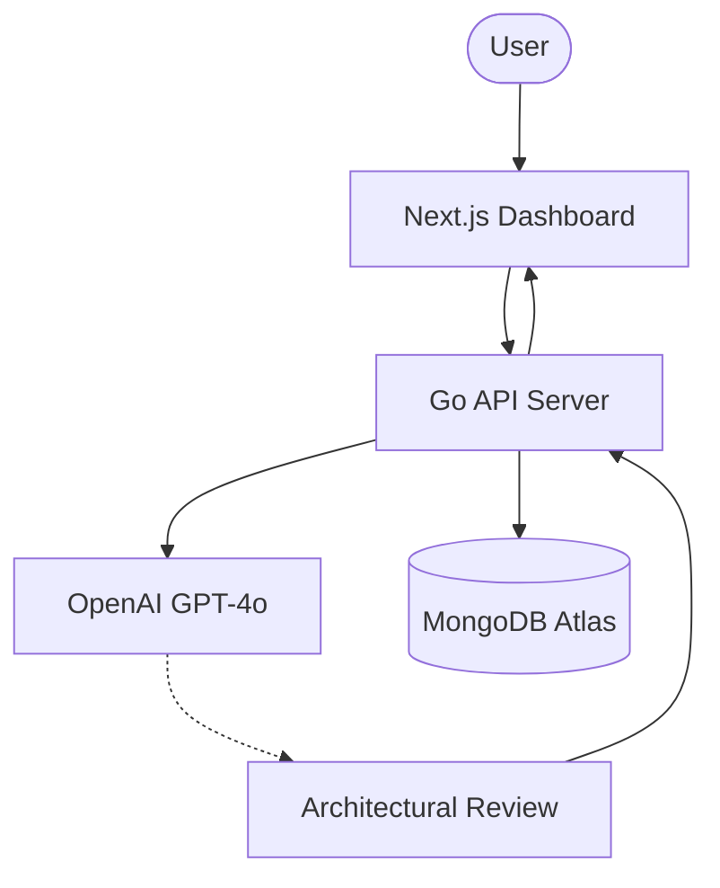

# 🛡️ ArchGuard — AI Engineering Decision Review System

<p align="center">
  
  
  
  
  
</p>

---

## ✨ Premium Intelligence for Software Architects

**ArchGuard** is a sophisticated, AI-driven platform designed to validate engineering and architectural decisions *before* a single line of code is written. By leveraging Large Language Models (LLMs), it identifies scalability bottlenecks, maintainability risks, and architectural anti-patterns in real-time.

---

## 💎 Core Features

### 🧠 **AI-Powered Decision Analysis**
Submit your architectural proposals—from database schemas to microservice boundaries—and receive instant, high-fidelity feedback on:
- **Risk Assessment**: High, Medium, and Low risk categorizations.
- **Scalability Scores**: Evaluation of how your design handles growth.
- **Maintainability Insights**: Detection of potential technical debt.

### 🏛️ **Advanced Architectural Patterns**
A curated library of industry-standard patterns (Event-Sourcing, CQRS, Hexagonal Architecture) integrated with AI to provide **Tailored Implementations** specific to your chosen technology stack.

### 📊 **Visual Insights & Reporting**
Beautiful, designer-focused dashboards that track decision history, health metrics, and organizational "decision memory."

### ⚡ **High-Performance Backend**
Built with **Go 1.24**, ensuring ultra-low latency processing and robust concurrency for mission-critical architectural reviews.

---

## 🛠️ The Technology Stack

| Layer | Technology | Rationale |
| :--- | :--- | :--- |
| **Frontend** | `Next.js 15` | Premium UI with App Router and Server Components. |
| **Styling** | `Vanilla CSS` | Total control over high-end animations and glassmorphism. |
| **Backend** | `Go (Golang)` | Type-safe, concurrent, and production-ready performance. |
| **Database** | `MongoDB` | Flexible document storage for evolving architectural data. |
| **AI Engine** | `OpenAI GPT-4o` | State-of-the-art reasoning for complex system design. |

---

## 🚀 Quick Setup

### 1. MongoDB Setup
ArchGuard requires a MongoDB instance. You can use a local instance or a free cluster from [MongoDB Atlas](https://www.mongodb.com/products/platform/atlas-database).

### 2. Backend (Go)
```bash
cd Backend
cp .env.example .env
# Edit .env with your MONGO_URI and OPENAI_API_KEY
go run main.go
```

### 3. Frontend (Next.js)
```bash
cd frontend
npm install
npm run dev
```

---

## 🏗️ System Architecture



---

## 🗺️ Roadmap to Excellence

- [x] **Phase 1: MVP** — Core AI analysis engine and decision history.
- [x] **Phase 2: UI Modernization** — Premium light-theme with grain overlays.
- [x] **Phase 3: Pattern Tailoring** — Technology-specific implementation guides.
- [ ] **Phase 4: Multi-Model Support** — Toggle between GPT-4o, Claude 3.5, and Gemini Pro.
- [ ] **Phase 5: Git Integration** — Automated reviews triggered by PR comments.

---

## 📄 License

This project is licensed under the **MIT License**.

```text
MIT License

Copyright (c) 2026 ArchGuard Team

Permission is hereby granted, free of charge, to any person obtaining a copy
of this software and associated documentation files (the "Software"), to deal
in the Software without restriction, including without limitation the rights
to use, copy, modify, merge, publish, distribute, sublicense, and/or sell
copies of the Software, and to permit persons to whom the Software is
furnished to do so, subject to the following conditions:

THE SOFTWARE IS PROVIDED "AS IS", WITHOUT WARRANTY OF ANY KIND, EXPRESS OR
IMPLIED, INCLUDING BUT NOT LIMITED TO THE WARRANTIES OF MERCHANTABILITY,
FITNESS FOR A PARTICULAR PURPOSE AND NONINFRINGEMENT...
```

---

<p align="center">
  Built with ❤️ for the Engineering Community.
</p>